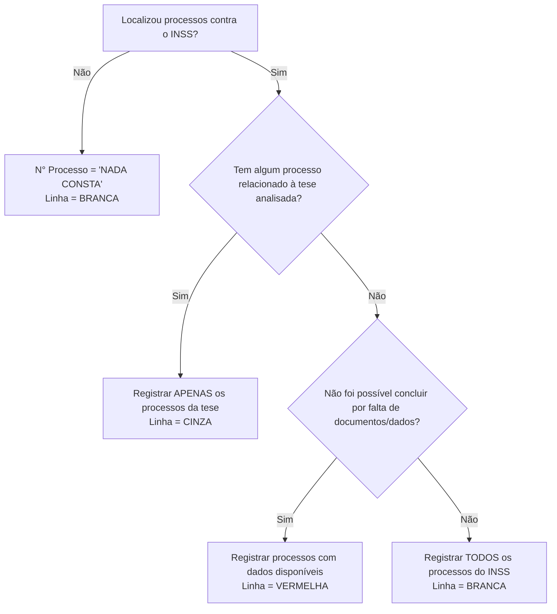
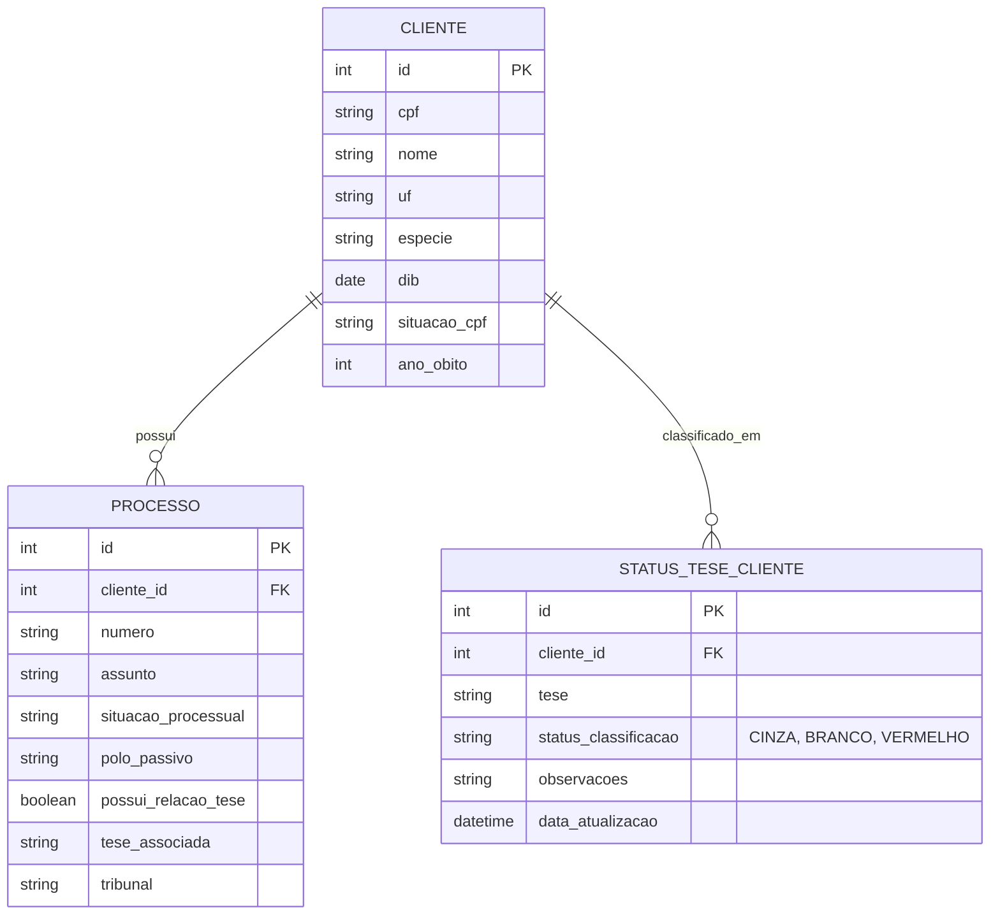

# Regras de Negócio e Especificações para Robôs de Pesquisa Processual

Com base na leitura completa do documento [RPA - CONSULTA DE PROCESSOS .docx](file:///C:/Users/nicol/OneDrive/Cursos%20online/Treinamento%20Python%20-%20Hashtag/C%C3%B3digos/Nexus%20Systems/Lodetti%20Silveira/C%C3%B3digos/Base%20-%20Documenta%C3%A7%C3%A3o/RPA%20-%20CONSULTA%20DE%20PROCESSOS%20.docx), estruturamos abaixo todas as regras e fluxos de negócio necessários para a codificação futura dos robôs RPA.

Este mapeamento servirá de base para a triagem de clientes, consulta nos tribunais (TRFs), consultas a sistemas secundários (Receita Federal e REVTETO), atualização de banco de dados, preenchimento das colunas do Google Sheets e integração final com o CRM.

---

## 1. Fluxo Geral de Decisão e Triagem Inicial

Antes de realizar buscas nos tribunais ou outros sistemas, o robô deve processar as informações cadastrais básicas do cliente: **Espécie de Benefício (ESP)**, **Data de Início do Benefício (DIB)** e a **UF do cliente**.

### A. Filtro por Espécie (Descarte Imediato)
Se a espécie do benefício do cliente for **ESP 92** ou **ESP 93**, o cliente é **descartado imediatamente** das teses de *Buraco Negro (BN)* e *Emendas Constitucionais (ECs)*.

### B. Triagem por DIB (Data de Início do Benefício)
A DIB determina qual tese previdenciária de readequação/teto é aplicável ao cliente:

| Faixa de DIB do Benefício | Tese de Readequação Aplicável | Ações Necessárias |
| :--- | :--- | :--- |
| **Anterior a 05/10/1988** | Nenhuma (Descartar) | Não segue para pesquisa de ECs nem de Buraco Negro. |
| **Entre 05/10/1988 e 05/04/1991** | **Buraco Negro (BN)** | Realizar pesquisa processual focada na tese de Buraco Negro (Art. 144 da Lei 8.213/91). |
| **Entre 06/04/1991 e 31/12/2003** | **Emendas Constitucionais (ECs)** | Realizar pesquisa processual focada em Emendas Constitucionais 20/98 e 41/03. |
| **Posterior a 31/12/2003** | Nenhuma (Descartar*) | * **Exceção**: Se a espécie for **ESP 21** (Pensão por Morte), o caso deve ser mantido para análise sucessória. Caso contrário, descartar. |

> [!NOTE]
> As teses de **Atividades Concomitantes** e **Tema 322 da TNU** não possuem faixas restritas de DIB descritas explicitamente na triagem do manual. A pesquisa delas deve ser guiada de acordo com o escopo da carteira de clientes ou indicação de suas respectivas teses.

### C. Definição do Tribunal (TRF) Competente
A UF de residência do cliente define qual portal de TRF o robô deve consultar:

- **TRF1** (PJe): AC, AP, AM, BA, GO, MA, MT, MG (ações antigas), PA, PI, RO, RR, TO, DF.
- **TRF2** (e-Proc): RJ, ES.
- **TRF3** (PJe): SP, MS.
- **TRF4** (e-Proc): RS, PR, SC. (Códigos base de referência em [trf4.py](file:///C:/Users/nicol/OneDrive/Cursos%20online/Treinamento%20Python%20-%20Hashtag/C%C3%B3digos/Nexus%20Systems/Lodetti%20Silveira/C%C3%B3digos/consulta_fases/trf4.py)).
- **TRF5** (PJe): AL, CE, PB, PE, RN, SE.
- **TRF6** (e-Proc/PJe): MG (Tribunal específico novo).

---

## 2. Regras de Busca nos Portais dos Tribunais

Para cada cliente ativo (não descartado na triagem), o robô executará o seguinte fluxo de busca no portal correspondente:

1. **Busca Inicial por CPF**: É a forma mais segura. O robô deve tentar localizar processos usando o CPF do cliente.
2. **Busca Secundária por Nome**: Se nada for localizado por CPF, fazer busca pelo nome completo do cliente.
   - **Tratamento de Homônimos**: Se a busca por nome retornar múltiplos resultados, o robô deve validar a identidade da parte (como o nome da mãe ou dados adicionais, se disponíveis) antes de registrar.
3. **Polo Passivo**: O robô deve verificar se o polo passivo da ação é o **INSS**. Processos sem participação do INSS devem ser ignorados.
4. **Varredura de Peças e Fases**: Se houver processos localizados contra o INSS, o robô precisa ler as informações principais, os assuntos cadastrados e, caso necessário, extrair as fases e documentos (petição inicial, contestação, recursos, sentença) para verificar palavras-chave da tese.

---

## 3. Especificidades das Teses e Palavras-Chave

Para determinar se um processo contra o INSS está relacionado a uma tese, o robô usará a combinação de **Assuntos Processuais oficiais** e **Palavras-Chave** no corpo dos autos/fases.

### Tese 1: Atividades Concomitantes
- **Objetivo**: Recálculo de RMI somando contribuições simultâneas (Art. 32 da Lei 8.213/91).
- **Assuntos Processuais Indicativos**:
  - `Renda Mensal Inicial (RMI)`, `Revisão de Renda Mensal Inicial`, `Revisão de Benefício`, `Revisão de Aposentadoria`, `Reajustes e Revisões Específicas`, `Alteração do Coeficiente de Cálculo`, `Cálculo de Benefício Previdenciário`, `Salário de Contribuição`, `Tempo de Contribuição`, `Benefícios em Espécie`, `Direito Previdenciário`.
- **Palavras-Chave**:
  - *Atividades concomitantes; Contribuições concomitantes; Atividade principal; Atividade secundária; Exercício simultâneo de atividades; Múltiplos vínculos empregatícios; Múltiplas atividades remuneradas; Salário de contribuição; Soma dos salários de contribuição; Inclusão de salários de contribuição; Cômputo de contribuições; Revisão de aposentadoria; Revisão de benefício; Revisão da RMI; Renda Mensal Inicial (RMI); Recálculo da RMI; Recálculo do benefício; Salário de benefício; Cálculo do benefício previdenciário; Revisão do cálculo da aposentadoria; Art. 32 da Lei nº 8.213/91; Revisão previdenciária; Diferenças vencidas e vincendas; Pagamento de diferenças decorrentes da revisão; Reflexos financeiros da revisão; Revisão do benefício NB; Revisão de Renda Mensal Inicial; Revisão de Aposentadoria; Cálculo de Benefício Previdenciário; Salário de Contribuição; Tempo de Contribuição; Reajustes e Revisões Específicas; Alteração do Coeficiente de Cálculo; Benefícios em Espécie; Direito Previdenciário.*

### Tese 2: Tema 322 da TNU
- **Objetivo**: Inclusão de auxílio-acidente no cálculo de aposentadoria rural de segurado especial.
- **Assuntos Processuais Indicativos**:
  - `Renda Mensal Inicial (RMI)`, `Revisão de Renda Mensal Inicial`, `Revisão de Benefício`, `Revisão de Aposentadoria`, `Reajustes e Revisões Específicas`, `Alteração do Coeficiente de Cálculo`, `Cálculo de Benefício Previdenciário`, `Aposentadoria por Idade Rural`, `Benefícios em Espécie`, `Direito Previdenciário`.
- **Palavras-Chave**:
  - *Auxílio-acidente; aposentadoria por idade rural; segurado especial; renda mensal inicial (RMI); período básico de cálculo (PBC); revisão de benefício; revisão da RMI; incremento ou majoração da RMI; cálculo da aposentadoria; salário de benefício (salário-de-benefício); benefício superior ao salário mínimo; inclusão, cômputo, incorporação ou consideração do auxílio-acidente no cálculo da aposentadoria; reflexos do auxílio-acidente; revisão de aposentadoria rural; revisão da aposentadoria por idade rural; valor da aposentadoria rural; recálculo da aposentadoria rural; recálculo da RMI; revisão para inclusão do auxílio-acidente; diferenças vencidas e vincendas; revisão do benefício NB; pagamento das diferenças decorrentes da revisão; reflexos financeiros da revisão; concessão de revisão previdenciária.*

### Tese 3: Emendas Constitucionais (ECs 20/98 e 41/03)
- **Objetivo**: Readequação do benefício limitado ao teto previdenciário no momento da concessão.
- **Assuntos Processuais Indicativos**:
  - `Renda Mensal Inicial (RMI)`, `Revisão de Renda Mensal Inicial`, `Revisão de Benefício`, `Revisão de Aposentadoria`, `Reajustes e Revisões Específicas`, `Alteração do Coeficiente de Cálculo`, `Cálculo de Benefício Previdenciário`, `Aposentadoria por Idade Rural`, `Benefícios em Espécie`, `Direito Previdenciário`.
- **Palavras-Chave**:
  - *Teto previdenciário; revisão do teto; limitação ao teto; teto máximo do salário de contribuição; salário-de-benefício limitado ao teto; renda mensal inicial (RMI); revisão da RMI; revisão de benefício; revisão de aposentadoria; readequação ao teto; adequação aos novos tetos constitucionais; Emenda Constitucional nº 20/1998; Emenda Constitucional nº 41/2003; excedente ao teto; recuperação de diferenças; recomposição da renda mensal; salário-de-benefício; cálculo da RMI; diferenças vencidas e vincendas; pagamento de diferenças; revisão previdenciária; reajuste de benefício; benefícios limitados ao teto; tetos das ECs 20/98 e 41/03.*
- **Consulta Extra (REVTETO)**:
  - Para esta tese, o robô deve consultar `http://revteto.inss.gov.br/`.
  - Se retornar **"Benefício Revisto"**, o caso é descartado. Registrar **"BENEFÍCIO REVISTO"** na coluna SITUAÇÃO e marcar como **CINZA**.

### Tese 4: Buraco Negro (BN)
- **Objetivo**: Recálculo administrativo do Art. 144 da Lei 8.213/91 para benefícios concedidos entre 05/10/1988 e 05/04/1991.
- **Assuntos Processuais Indicativos**:
  - `Renda Mensal Inicial (RMI)`, `Revisão de Renda Mensal Inicial`, `Revisão de Benefício`, `Revisão de Aposentadoria`, `Reajustes e Revisões Específicas`, `Alteração do Coeficiente de Cálculo`, `Cálculo de Benefício Previdenciário`, `Benefícios em Espécie`, `Direito Previdenciário`, `Revisão do art. 144 da Lei nº 8.213/91`, `Buraco Negro Previdenciário`, `Recálculo de Benefício`, `Revisão de Benefício Concedido antes da Lei nº 8.213/91`.
- **Palavras-Chave**:
  - *Buraco Negro Previdenciário; Art. 144 da Lei nº 8.213/91; Revisão do art. 144; Recálculo da Renda Mensal Inicial (RMI); Revisão de benefício concedido entre 05/10/1988 e 05/04/1991; Readequação da Renda Mensal Inicial; Diferenças decorrentes da revisão do art. 144; Revisão de aposentadoria concedida no período de transição; Benefício concedido antes da Lei nº 8.213/91; Revisão de benefício do período conhecido como Buraco Negro; Reprocessamento do benefício; Revisão administrativa prevista na Lei nº 8.213/91; Renda Mensal Inicial incorreta; Diferenças de benefício previdenciário; Revisão de aposentadoria por erro no recálculo legal.*

---

## 4. Regras de Falecimento e Pesquisa de Sucessores

Após as pesquisas básicas nos tribunais, o robô deve verificar a situação cadastral do segurado nos casos das teses de **ECs** e **Buraco Negro**:

### A. Consulta da Situação do CPF
- Consultar a Receita Federal: `https://servicos.receita.fazenda.gov.br/servicos/cpf/consultasituacao/consultapublica.asp`
- Se for constatado o falecimento, o robô deve **anotar o ano do óbito** ao lado do nome do cliente na planilha (exemplo: `João da Silva (Óbito: 2018)`).

### B. Regra para Pensão por Morte (ESP 21)
- Se o benefício ativo for da espécie **ESP 21** e o óbito do segurado instituidor ocorreu há **mais de 5 anos**:
  - O caso é **descartado** (marca a linha do cliente em **CINZA**).

### C. Fluxo de Pesquisa Sucessória (Se o segurado faleceu)
1. **Para Emendas Constitucionais (DIB de 06/04/1991 a 31/12/2003)**:
   - Se o cliente titular faleceu, o robô deve pesquisar processos também em nome do **Cônjuge**.
   - Se o cônjuge também for falecido, pesquisar em nome dos **Filhos**.
2. **Para Buraco Negro (DIB de 05/10/1988 a 05/04/1991)**:
   - Se o cliente titular faleceu, pesquisar processos em nome do **Cônjuge**.
   - Se o cônjuge faleceu **há mais de 5 anos**: **Encerrar a pesquisa** (não pesquisa em nome dos filhos).
   - Se o cônjuge está vivo ou faleceu **há menos de 5 anos**: Realizar a pesquisa em nome dos **Filhos**.

---

## 5. Regras de Escrita e Formatação na Planilha

Para cada tese rodada, a planilha receberá 3 novas colunas ao final: **Número do Processo**, **Assunto do Processo** e **SITUAÇÃO**.

### A. Padrão de Preenchimento para Múltiplos Processos
Quando um cliente possuir mais de um processo que precise ser registrado, as informações devem ir na **mesma célula**, mantendo a mesma ordem nas três colunas, separadas por uma barra `" / "`:
- **N° PROCESSO**: `5001234-56.2022.4.04.9999 / 5009876-12.2021.4.04.9999`
- **ASSUNTO**: `Revisão de Benefício Previdenciário / Revisão de Aposentadoria`
- **SITUAÇÃO**: `Sentença procedente / Processo em andamento`

### B. Tratamento de "NADA CONSTA"
Se nenhuma ação contra o INSS for localizada após as pesquisas de CPF e Nome, preencher:
- **N° PROCESSO**: `NADA CONSTA`
- **ASSUNTO** e **SITUAÇÃO**: Deixar em branco.
- **Cor da linha**: Permanecer **BRANCA**.

### C. Critérios de Cores das Linhas (Classificação Final)

O preenchimento final das linhas obedece a um fluxo de cores rigoroso baseado na análise dos processos contra o INSS:

- **CINZA (Grey)**:
  - **Critério**: Existe pelo menos 1 processo relacionado à tese (ou REVTETO com "Benefício Revisto", ou descarte de ESP 21 com óbito > 5 anos).
  - **Ação**: O robô registra na planilha **apenas** os processos que possuem relação com a tese. A linha é pintada de Cinza.
- **BRANCO (White)**:
  - **Critério**: Nenhum processo localizado possui relação com a tese (ou nada consta).
  - **Ação**: O robô registra **todos** os processos contra o INSS encontrados para o cliente na planilha. A linha permanece Branca.
- **VERMELHO (Red)**:
  - **Critério**: Existe processo contra o INSS, mas a falta de documentos ou informações impede o robô de confirmar ou afastar a relação com a tese.
  - **Ação**: O robô registra os processos com as informações que estiverem visíveis. A linha é pintada de Vermelho.

---

## 6. Estrutura Proposta para Banco de Dados e Integração (Sheets e CRM)

Para viabilizar a exibição correta nas planilhas e no CRM, os robôs devem salvar as informações estruturadas em um banco de dados relacional (ex: PostgreSQL ou SQLite) antes de disparar atualizações para as APIs externas.

### Sugestão de Modelo de Dados (Tabelas)

### Arquitetura do Robô
1. **Leitor de Entradas**: Usa [GoogleSheets.py](file:///C:/Users/nicol/OneDrive/Cursos%20online/Treinamento%20Python%20-%20Hashtag/C%C3%B3digos/Nexus%20Systems/Lodetti Silveira/C%C3%B3digos/consulta_fases/GoogleSheets.py) para extrair CPFs, UFs, Espécie e DIB da planilha inicial.
2. **Módulo de Triagem**: Roda os filtros de espécie e DIB salvando os descartes imediatos como "BRANCO" ou aplicando as teses corretas.
3. **Módulo de Pesquisa Processual**: Instancia o [NavegadorPy](file:///C:/Users/nicol/OneDrive/Cursos%20online/Treinamento%20Python%20-%20Hashtag/C%C3%B3digos/Nexus%20Systems/Lodetti Silveira/C%C3%B3digos/consulta_fases/navegador.py) para cada portal de TRF de acordo com a UF do cliente. Executa a busca e raspa dados principais e movimentações.
4. **Motor de Classificação**: Analisa os textos extraídos das fases e assuntos contra os dicionários de palavras-chave de cada tese. Define a cor do cliente (CINZA, BRANCO, VERMELHO).
5. **Módulo de Atualização (Sheets & CRM)**:
   - Salva o resultado no Banco de Dados para controle histórico e auditoria.
   - Atualiza a Planilha do Google Sheets (escrevendo as 3 novas colunas e formatando as cores das linhas).
   - Envia um webhook ou chamada de API para atualizar a ficha correspondente no CRM com o status da tese encontrada.
